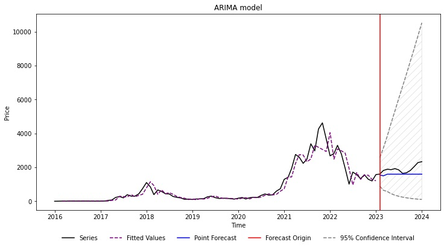

# Ethereum Price Analysis with Time Series Applications

## Overview

This repository contains the project "Ethereum Price Analysis with Time Series Applications", which was developed as part of the **STAT497 Time Series Applications course at Middle East Technical University**. The goal of this study is to forecast **Ether (ETH) prices** using historical data from 2016 to 2024 by applying various time series models.

## Project Structure
script.ipynb – Jupyter Notebook containing the full implementation of the study.
Paper_Ethereum_Price Analysis_with_Time_Series_Applications.pdf – The final project report detailing methodology, results, and analysis.
data.xlsx – Folder containing the dataset used in the study.
Analysis_and _model.html – Rendered version of the Jupyter Notebook, easier to view the results without running the script. 
README.md – This file. Explanation of the repository.

## Methodology
**Data Preprocessing**

Handling missing values and anomalies.
Applying Box-Cox transformation to stabilize variance.

**Stationarity Testing**

Conducted KPSS, ADF, and HEGY tests to check for stationarity.
Differenced the series to remove trends and make it stationary.

**Model Selection & Forecasting**

Evaluated multiple models including:
ARIMA(0,1,3)
TBATS
Prophet
Neural Networks
Exponential Smoothing (Simple, Holt’s, Holt-Winter’s)
Used AIC, BIC, MAPE, MAE, RMSE metrics for model comparison.

**Results & Findings**

Neural Network model outperformed other models in forecasting ETH prices.
Holt’s Exponential Smoothing was the best among exponential smoothing models.
ARIMA(0,1,3) was the best ARIMA/SARIMA model for this dataset.

## Requirements
To run this project, you need the following Python libraries:

'pip install pandas numpy matplotlib statsmodels scipy tensorflow pmdarima'

## How to Use

Clone the repository:
'git clone https://github.com/MelihCK/Ether-Price-Forecasting-with-Time-Series-Applications.git'
'cd Ether-Price-Forecasting-with-Time-Series-Applications'

Open the Jupyter Notebook:
'jupyter notebook script.ipynb'

Run all the cells to reproduce the results.

## Contributions & Future Work
This study highlights the potential of **machine learning models** in forecasting volatile assets like Ethereum.
Future improvements may include adding new variables such as **trading volume** and **market sentiment** to enhance prediction accuracy.
